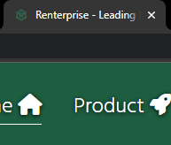
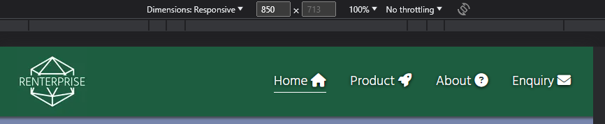
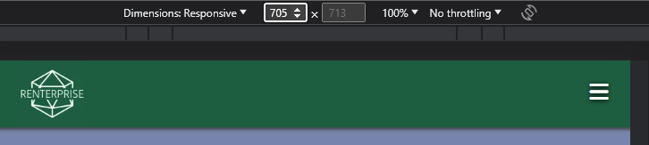
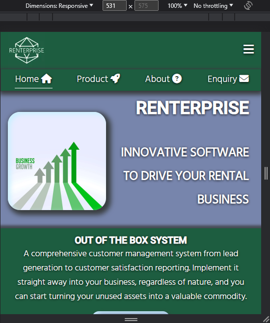
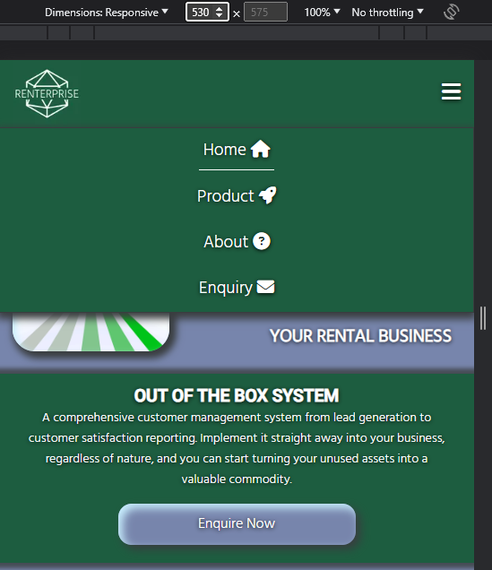
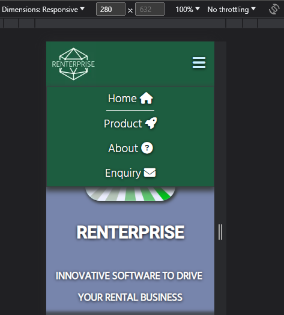

# Renterprise
<div style="width:100%; height:100px; background-color:#1D5D40; margin-left:auto;margin-right:auto;">
<a href="index.html" target="_self">
            
        </a>
</div>

Renterprise is a brand new solution that encompasses many key qualities of CRM software and applies it to the ever growing rental sector.
There are organisations that are struggling to sell stock and customers that do not want to have the outlay of purchasing a product. 

More people are turning to rentals as the world finances are in disarray and they can have your product at a much more managable cost. 

**So why not start with Renterprise today?**

# User Experience Design

## Target Audience

- Current business owners looking to change their business model
- Start up entrepenuers looking to offer something new

## Website User Stories

- I want to find product information quickly
    1. This is achieved by providing links to all pages on every page (except thanks.html which is a message).
    2. The user can click and navigate quickly, and effectively through the pages.
    3. They can then also return to previous pages without the use of the browser back button or a back button on the mouse.
- I want to be able to contact the company for more information.
    1. The contact.html page is visible from every page.
    2. Furthermore, on the index page there is a secondary call to action button half way down.
    3. Multiple methods (phone/email/post) of contact are provided.
    4. These methods are also actionable with mailto: and tel: in the href attributes.
- I want to know where the company is based (working hours of support)
    - A map and address within the contact.html page showing the UK as the address.
- I want to improve my business, will this help me?
    1. Proposition cards on the index.html page highlight the benefits of Renterprise
    2. Also on the index.html page at the bottom, there is a features box. This box also contains a button to go directly to the product.html page.
    3. The product.html page provides greater emphasis on the features from the index.html page.

## Wireframe Design

Website wireframe was created using Figma[^1]. The image below shows the concept for the index page, which would be the underlying template for other pages.

It includes an example of a responsive page (product.html) for mobile and how the screen resolution change would affect that particular page.

There is also a flow diagram for the concept of the contact form.


## Logo

The logo was created using the website LOGO.com.[^2]

### Logo Process 
Using their step by step builder a full brand could be created from scratch, firstly the selection of software industry was chosen as it was accurate and appropriate.


Next, it gave an overall palette choice, blues, greens etc. Given the fact that a product is trying to be sold, and green symbolises wealth it seemed like a logical decision.


The creator then asked for a styling of the font to be used, a modern font was the best choice as it is for a modern product.


The final font choice for the logo was then made and it displayed the generated logo with it.


This was then the branding provided.


## Breakdown of Design

### Colour Theme

Colour theme was initially chosen and subsequently revised with Coolors.[^3] 
The overall palette was picked with the website tools which enabled complementary and contrasting colour choices based upon the initial colour from the logo.


### Typography

The font chosen, was initially based upon the font in the logo - Hind Light, a secondary font of Roboto was chosen as it was visually complementary to this initial font. Roboto features as the h1,h2 and h3 font. All other text within the website (barring Google Map) is Hind. These fonts were acquired from Google Fonts[^4]. If loading of the font(s) fail for any reason then there is the font Sans Serif chosen as a backup display font.

### Tab Bar

It is desired to have a reminder (especially with current web browsers) of the page even if the user loads another page in a new tab. Text alone is never sufficient as at first glance, the name may not all be seen when too many tabs are open. So an icon is key. Also ensuring the first part of the text contains the company name. This then led to the choice of the title being "Renterprise - Leading Rental CRM System", the consumer would see the word "Renterprise" for the longest as more tabs could be added. There is also the logo included for further clarity.



### Images

Images were all sourced for free :

| Filename                | Used         |                                                                         |
| ----------------------- | ------------ | ----------------------------------------------------------------------- |
| crm.webp[^5]            | product.html | [View](assets/images/crm.webp "Customer Relationship Management Image") |
| delivery.webp[^6]       | product.html | [View](assets/images/delivery.webp "Delivery Image")                    |
| growth.webp[^7]         | index.html   | [View](assets/images/growth.webp "Growth Image")                        |
| inventory.webp[^8]      | product.html | [View](assets/images/inventory.webp "Inventory Image")                  |
| money.webp[^9]          | index.html   | [View](assets/images/money.webp "Money Image")                          |
| move-forward.webp[^10]  | N/A          | [View](assets/images/move-forward.webp "Forward Arrows Image")          |
| opportunity.webp[^11]   | index.html   | [View](assets/images/opportunity.webp "Opportunity Image")              |
| payments.webp[^12]      | product.html | [View](assets/images/payments.webp "Card Payments Image")               |
| reporting.webp [^13]    | N/A          | [View](assets/images/reporting.webp "Reporting Image")                  |
| server.webp [^14]       | N/A          | [View](assets/images/server.webp "Server Image")                        |
| streamline.webp [^15]   | index.html   | [View](assets/images/streamline.webp "Streamline Image")                |
| workflow.webp [^16]     | N/A          | [View](assets/images/workflow.webp "Workflow Image")                    |

*NB. All those that are N/A were due to be entered as further entries into the product.html page*

# Features

## Existing Features

### Navigation Bar

A responsive navigation bar included in the header of all the pages :

#### Default Size


#### Smaller Navigation Bar


#### Burger Menu At 705px


#### Burger Menu Responsive Drop

#### Lower Resolution Burger Menu Drop

#### Galaxy Fold Resolution Drop (280px)


## Proposed Features


# References
[^1]: Figma is a free website for designing storyboards and wireframes : https://www.figma.com/
[^2]: LOGO website used for creating a logo and branding from scratch for free : https://app.logo.com/
[^3]: Coolors website for creating free colour themes : https://www.coolors.com/
[^4]: Google's font listing, a very large database of free online hosted fonts : https://fonts.google.com/
[^5]: CRM Image : https://www.freepik.com/free-vector/data-center-isometric-composition_4327444.htm#page=2&query=computing&position=0&from_view=search&track=sph
[^6]: Delivery Image : https://www.freepik.com/free-vector/delivery-logos-collection-companies_2607189.htm#query=fast%20delivery&position=1&from_view=search&track=ais
[^7]: Growth Image : https://www.freepik.com/free-vector/business-success-growth-chart-arrow-concept_5129993.htm#query=business%20growth&position=1&from_view=search&track=ais
[^8]: Inventory Image : https://www.freepik.com/free-vector/conveyor-belt-warehouse-concept-illustration_37113966.htm#query=software%20inventory&position=48&from_view=search&track=ais
[^9]: Money Image : https://www.vecteezy.com/vector-art/2490867-pile-of-pound-coins-with-banknote-stuck-in-middle-banking-metaphor-can-be-used-for-landing-pages-websites-posters-mobile-apps
[^10]: Moving Forward Image :https://www.vecteezy.com/vector-art/5611491-businessmen-run-ahead-governed-by-a-business-team-and-a-leadership-concept-flat-style-cartoon-illustration-vector
[^11]: Opportunity Image : https://www.vecteezy.com/free-vector/business-opportunity
[^12]: Card Payment Image : https://www.vecteezy.com/vector-art/15881043-flat-isometric-3d-illustration-online-payment-security
[^13]: Reporting Image : https://www.freepik.com/free-vector/site-stats-concept-illustration_7140739.htm#query=CRM&position=42&from_view=search&track=sph
[^14]: Servers Image : https://www.freepik.com/free-vector/data-center-isometric-composition_4327444.htm#page=2&query=computing&position=0&from_view=search&track=sph
[^15]: Streamline AI Image : https://www.freepik.com/free-ai-image/colorful-image-road-with-lights-it_42026233.htm#query=streamline&position=2&from_view=search&track=ais_ai_generated
[^16]: Workflow Image : https://www.vecteezy.com/vector-art/10682818-receive-orders-and-prepare-to-pack-products-to-send-to-customers-beginnings-as-a-merchant-and-small-business-owner

<!--
Heading	
# H1
## H2
### H3

Bold	**bold text**

Italic	*italicized text*

Blockquote	> blockquote

Ordered List	
1. First item
2. Second item
3. Third item

Unordered List	
- First item
- Second item
- Third item

Code	`code`

Horizontal Rule	---

Link	[title](https://www.example.com)

Image	

Table	| Syntax | Description |
| ----------- | ----------- |
| Header | Title |
| Paragraph | Text |

Fenced Code Block	```
{
  "firstName": "John",
  "lastName": "Smith",
  "age": 25
}
```

Footnote	Here's a sentence with a footnote. [^1]

[^1]: This is the footnote.

Heading ID	### My Great Heading {#custom-id}

Definition List	term
: definition

Strikethrough	~~The world is flat.~~

Task List	
- [x] Write the press release
- [ ] Update the website
- [ ] Contact the media

Emoji
(see also Copying and Pasting Emoji)	That is so funny! :joy:

Highlight	I need to highlight these ==very important words==.

Subscript	H~2~O

Superscript	X^2^
-->