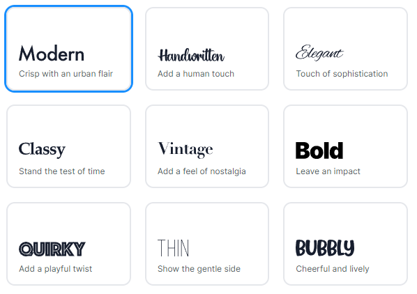
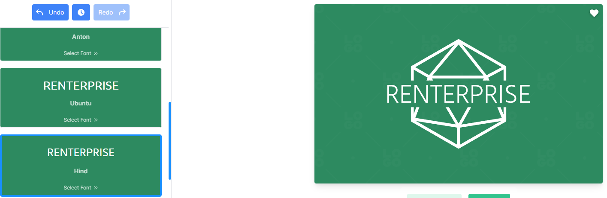
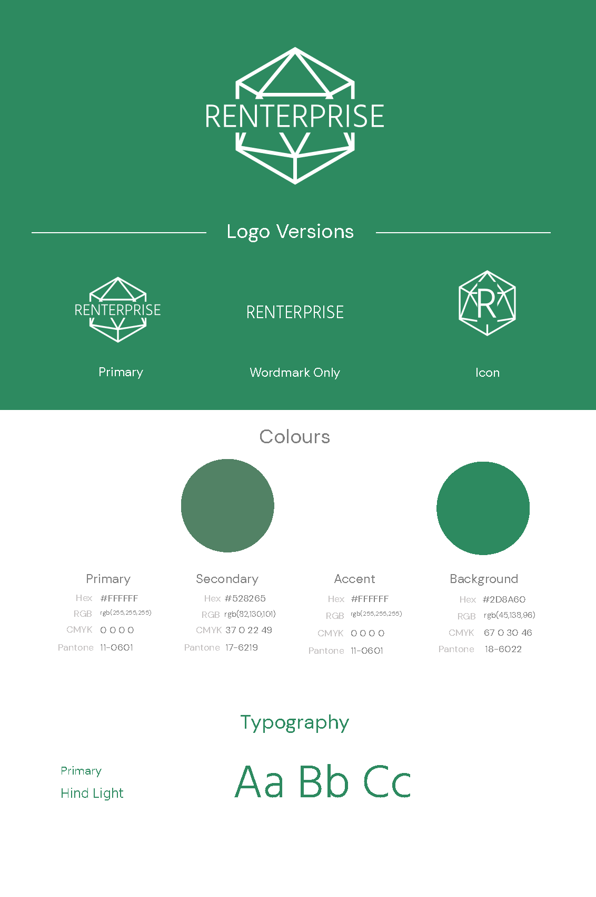
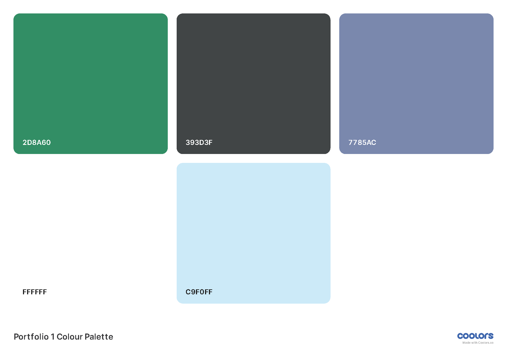

# Renterprise

Renterprise is a brand new solution that encompasses many key qualities of CRM software and applies it to the ever growing rental sector.
There are organisations that are struggling to sell stock and customers that do not want to have the outlay of purchasing a product. 

More people are turning to rentals as the world finances are in disarray and they can have your product at a much more managable cost. 

**So why not start with Renterprise today?**

# User Experience Design

## Target Audience

- Current business owners looking to change their business model
- Start up entrepenuers looking to offer something new

## Website User Stories

- I want to find product information quickly
- I want to be able to contact the company for more information
- I want to know where the company is based (working hours of support)
- I want to improve my business, will this help me?

## Wireframe Design

Website wireframe were created using Figma[^1] :


## Logo

The logo was created using the website LOGO.com[^2] 

### Process 
Using their step by step builder a full brand could be created from scratch, firstly the selection of software industry was chosen as it was accurate and appropriate :


Next, it gave an overall palette choice, blues, greens etc. Given the fact that a product is trying to be sold, and green symbolises wealth it seemed like a logical decision :


The creator then asked for a styling of the font to be used, a modern font was the best choice as it is for a modern product :


The final font choice for the logo was then made and it displayed the generated logo with it :


This was then the branding provided :


## Theme

Colour theme was initially chosen and subsequently revised with Coolors[^3] the overall palette was picked with the website tools which enabled complementary and contrasting colour choices based upon the initial colour from the logo.



# References
[^1]: Figma website for designing storyboards and wireframes : https://www.figma.com/
[^2]: LOGO website used for creating a logo and full branding from scratch : https://app.logo.com/
[^3]: Coolors website for creating colour themes : https://www.coolors.com/
<!--
Heading	
# H1
## H2
### H3

Bold	**bold text**

Italic	*italicized text*

Blockquote	> blockquote

Ordered List	
1. First item
2. Second item
3. Third item

Unordered List	
- First item
- Second item
- Third item

Code	`code`

Horizontal Rule	---

Link	[title](https://www.example.com)

Image	

Table	| Syntax | Description |
| ----------- | ----------- |
| Header | Title |
| Paragraph | Text |

Fenced Code Block	```
{
  "firstName": "John",
  "lastName": "Smith",
  "age": 25
}
```

Footnote	Here's a sentence with a footnote. [^1]

[^1]: This is the footnote.

Heading ID	### My Great Heading {#custom-id}

Definition List	term
: definition

Strikethrough	~~The world is flat.~~

Task List	
- [x] Write the press release
- [ ] Update the website
- [ ] Contact the media

Emoji
(see also Copying and Pasting Emoji)	That is so funny! :joy:

Highlight	I need to highlight these ==very important words==.

Subscript	H~2~O

Superscript	X^2^
-->